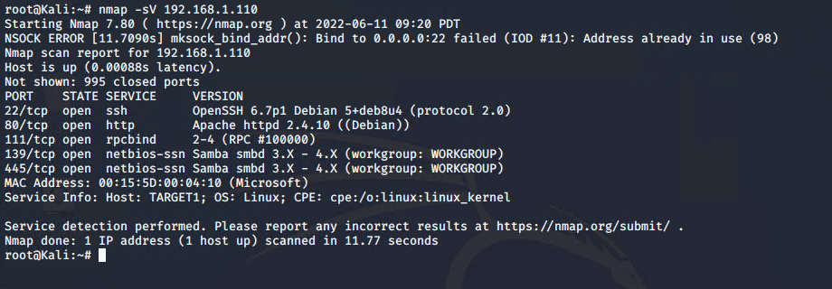
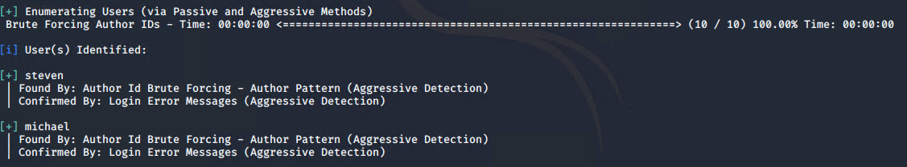
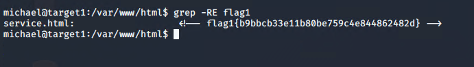
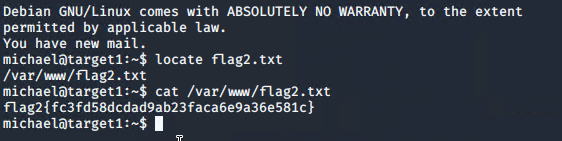
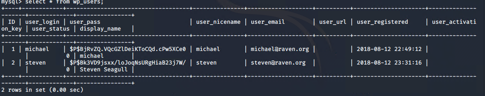
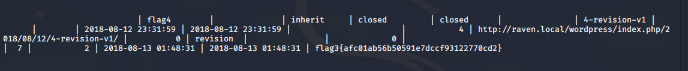
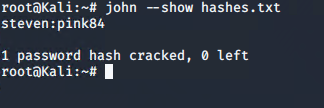
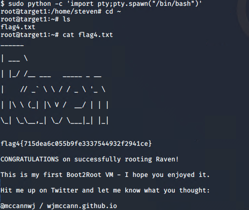

# Red Team: Summary of Operations

## Table of Contents
- Exposed Services
- Critical Vulnerabilities
- Exploitation
---
### Exposed Services

Nmap scan results for each machine reveal the below services and OS details:

```bash
$ nmap -sV 192.168.1.110  
```


This scan identifies the services below as potential points of entry:
- Target 1: - List of exponsed service: 
  
  - 22  SSH
  - 80  http
  - 111  rpcbind
  - 139 netbios-ssn
  - 445 microsoft-ds

The following vulnerabilities were identified on each target:
- Target 1

- Network Mapping and user enumeration(wordpress) CVE-2017-5487
Nmap was used to uncover open ports and plan an attack.
- Wpscan was used to list users on wordpress site.
Weak user password
I was able to guess the user password of Michael.
- MySQL Database Access CVE-2016-6663
I was able to discover a file with the username and password into MySQL database.
- MySQL Data Extraction CVE-2015-2075
I was able to search through tables and databases in Mysql and I was able to get the
hashes of the two users Michael and Steven on wordpress
---

### Exploitation

I now enumerated the wordpress site with
 `wpscan --url http://192.168.1.110/wordpress
-eu`
 this showed me that there were two users identified Michael and Steven
 


The Red Team was able to penetrate `Target 1` and retrieve the following confidential data:
- Target 1

 Used ssh to gain access to the user Michael. The password was the same as the username.
(weak password) I then used grep to find flag1 and it was found in /var/www/html/service.html



While still logged in as michael, performed `locate flag2.txt` and found flag located in /var/www/flag2.txt



Searched for database configuration files with 
`cat /var/www/html/wordpress/wp-config.php`
Then used the credentials to log into MySQL and dump WordPress user password hashes.



By running the following command I entered the wp_posts table and immediately found flag 3

`select * from wp_posts;`



I used john to crack the hashes I found in eailer. The command I used was `john wp_hashes.txt`. Through this I was able to get steven’s cracked hash which was `pink84`.



I was then able to ssh in as Steven `ssh steven@192.168.1.110` the password was `pink84`

Once I was in as steven I escalated to root as steven using the python command he had
access to. The python command was `sudo python -c ‘import pty;pty.spawn(“/bin/bash”)’` This gave me access as root ‘cd /root’. I then used ‘ls’ to discover the last flag.


  